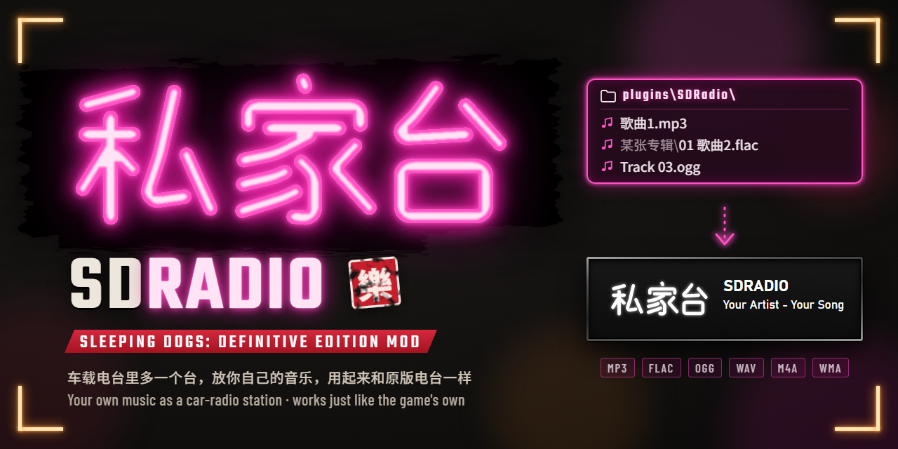

# Sleeping Dogs: Definitive Edition — custom radio station (SDRadio)



[中文](#中文) | [English](#english)

## 中文

给《热血无赖：终极版》的车载电台加一个新电台，播放你自己的音乐。它和游戏自带的电台完全一样：切台时显示台名、
图标和“歌手 - 歌名”，一首放完自动换下一首（随机，避开刚放过的），音量、车内收音机的音效、暂停和对话时自动
压低也都和原版电台一致。

状态：Windows 上已在游戏内验证（FLAC）；Linux / Steam Deck / macOS 还没测试。

> 适用于**任何版本**的《热血无赖：终极版》，Windows 10/11 64 位。想了解原理、自己编译，或已经装过其他 mod，
> 请看 [ADVANCED.md](ADVANCED.md)。

### 安装（大约三分钟）

**第 1 步：下载**

点这里下载 **[SDRadio.zip](https://github.com/aUsernameWoW/sleeping-dogs-custom-radio/releases/latest/download/SDRadio.zip)**。
也可以在 [Nexus Mods](https://www.nexusmods.com/sleepingdogsdefinitiveedition/mods/175?tab=files) 的 Files
页面下载主文件 “SDRadio”，内容相同。

压缩包里只有这些：

```text
dinput8.dll                  ← Ultimate ASI Loader：让游戏加载 mod 的“加载器”
plugins\
    SDRadio.asi              ← mod 本体
    SDRadio-THIRD-PARTY-NOTICES.md
    SDRadio\                 ← 你的音乐放在这里
        PUT-YOUR-MUSIC-HERE.txt
```

**第 2 步：打开游戏文件夹**

1. 打开 Steam，进入「库」。
2. 在左侧列表里右键点「Sleeping Dogs: Definitive Edition」→「管理」→「浏览本地文件」。
3. 弹出来的就是游戏文件夹，里面有 `sdhdship.exe`（如果电脑不显示扩展名，就是一个叫 `sdhdship` 的程序）。

**第 3 步：把文件放进去**

1. 双击打开下载的 `SDRadio.zip`。
2. 选中里面的 `dinput8.dll` 和 `plugins` 文件夹，一起拖进游戏文件夹。
3. 如果 Windows 弹出「替换或跳过文件」，说明游戏文件夹里已经有 `dinput8.dll` 了（你以前装过别的 mod，
   加载器已经在了），选「跳过该文件」。已有的 `plugins` 文件夹会自动合并，不用管。

**第 4 步：放入音乐**

把你的音乐文件复制到游戏文件夹里的 `plugins\SDRadio`。放好后应该是这样（只列出相关的部分）：

```text
SleepingDogsDefinitiveEdition\
    sdhdship.exe
    dinput8.dll
    plugins\
        SDRadio.asi
        SDRadio\
            歌曲1.mp3
            某张专辑\
                01 歌曲2.flac
```

- 支持 MP3、FLAC、WAV、OGG，也支持 M4A/AAC、WMA；
- 可以有子文件夹，最多 255 首；
- 歌名和歌手从音乐文件自带的信息里读取，没有的话就用文件名。

**第 5 步：在游戏里收听**

照常从 Steam 启动游戏，上一辆车，像平时一样切换电台。新电台排在所有电台的**最后**，图标是霓虹灯风格的
「私家台」，台名默认是 “SDRADIO”。

### 常见问题

**切台时找不到新电台**

- 看看 `plugins` 里有没有出现 `SDRadio.ini` 和 `SDRadio.log`。没有的话说明 mod 没被加载：检查 `dinput8.dll`
  是否和 `sdhdship.exe` 在同一层（不要多套一层文件夹），杀毒软件有没有删掉它（ASI 加载器偶尔会被误报，可以从
  隔离区还原并把游戏文件夹加入排除项）；如果第 3 步跳过了原有的 `dinput8.dll`，那个文件可能不是 ASI 加载器，
  备份后换成压缩包里的；
- 确认 `plugins\SDRadio` 里有音乐文件。改动音乐文件夹后要重启游戏；
- 还是不行的话，按下面的方法反馈，并附上 `plugins\SDRadio.log`。

**有的歌放不出来**

M4A/AAC、WMA 这类格式靠 Windows 自带的解码器，个别文件可能不行。换成 MP3 或 FLAC 最稳。

**想改台名或者换音乐文件夹**

用记事本打开 `plugins\SDRadio.ini`，改完保存，重启游戏。每一项都有中文说明。台名最多约 21 个汉字。

**想换成自己画的电台图标**

1. 画一张比例 2:1 的图（推荐 512×256），背景透明，存成 PNG；
2. 命名为 `logo.png`，放进 `plugins\SDRadio`；
3. 重启游戏。

游戏会把所有电台图标显示成白色，所以显示出来的是图案的形状，不是颜色。删掉 `logo.png` 就回到自带的图标。

**更新**

下载新的 `SDRadio.zip`，只把里面的 `plugins` 文件夹拖进游戏文件夹，Windows 询问时选「替换目标中的文件」。
你的音乐和 `SDRadio.ini` 不会受影响。

**卸载**

删掉 `plugins` 里所有名字以 `SDRadio` 开头的文件，以及 `SDRadio` 文件夹（里面是你自己的音乐，需要的话先
移走）。如果 `plugins` 里已经没有其他 `.asi` 文件了，`dinput8.dll` 也可以删掉。

**Linux / Steam Deck**

还没测试。按上面的步骤装好后，在 Steam 里右键游戏 →「属性」→「启动选项」，填入
`WINEDLLOVERRIDES="dinput8=n,b" %command%`，否则 Proton 不会加载 `dinput8.dll`。M4A/AAC、WMA 在 Proton 下
不一定能播放，建议用 MP3、FLAC 或 OGG。

**遇到问题怎么反馈**

在 [GitHub Issues](https://github.com/aUsernameWoW/sleeping-dogs-custom-radio/issues) 或 Nexus Mods 页面的
Bugs 标签里说明情况，并附上 `plugins\SDRadio.log`。

### 致谢

感谢 [SDmodding](https://github.com/SDmodding) 社区公开的《热血无赖》研究资料和工具，开发这个 mod 时用到了它们。

与 Square Enix、United Front Games、Audiokinetic 均无关联。

## English

Adds a station to the car radio that plays your own music. It works just like the game's own stations: its
name, logo and "artist - title" on screen when you switch to it, the next track starts by itself (random,
avoiding recent ones), and volume, the car-radio sound, pausing and turning down for dialogue behave like the
original stations.

Status: verified in game on Windows (FLAC); Linux / Steam Deck / macOS not yet tested.

> Works with **any version** of Sleeping Dogs: Definitive Edition, Windows 10/11 64-bit. For how it works,
> building it, or adding it to an existing mod setup, see [ADVANCED.md](ADVANCED.md).

### Installing (about three minutes)

**Step 1: download**

Download **[SDRadio.zip](https://github.com/aUsernameWoW/sleeping-dogs-custom-radio/releases/latest/download/SDRadio.zip)**.
The main file "SDRadio" on the Files tab of [Nexus Mods](https://www.nexusmods.com/sleepingdogsdefinitiveedition/mods/175?tab=files)
is the same thing.

The zip holds only this:

```text
dinput8.dll                  ← Ultimate ASI Loader: the "loader" that makes the game load mods
plugins\
    SDRadio.asi              ← the mod itself
    SDRadio-THIRD-PARTY-NOTICES.md
    SDRadio\                 ← your music goes here
        PUT-YOUR-MUSIC-HERE.txt
```

**Step 2: open the game folder**

1. Open Steam and go to your Library.
2. Right-click "Sleeping Dogs: Definitive Edition" in the list on the left → Manage → Browse local files.
3. The folder that opens is the game folder. It contains `sdhdship.exe` (shown as just `sdhdship` if
   Windows hides file extensions).

**Step 3: copy the files in**

1. Double-click the downloaded `SDRadio.zip` to open it.
2. Select `dinput8.dll` and the `plugins` folder inside and drag both into the game folder.
3. If Windows shows "Replace or Skip Files", the game folder already has a `dinput8.dll` (you already have a
   loader from another mod): choose "Skip this file". An existing `plugins` folder is merged automatically.

**Step 4: add your music**

Copy your music files into `plugins\SDRadio` in the game folder. It should then look like this (only the
relevant parts):

```text
SleepingDogsDefinitiveEdition\
    sdhdship.exe
    dinput8.dll
    plugins\
        SDRadio.asi
        SDRadio\
            Song 1.mp3
            Some Album\
                01 Song 2.flac
```

- MP3, FLAC, WAV and OGG work, and so do M4A/AAC and WMA;
- subfolders are fine, up to 255 tracks;
- titles and artists come from the music files' own tags, or else the file name.

**Step 5: listen in game**

Start the game from Steam as usual, get into a car and switch radio stations as you normally would. The new
station comes **last**, with a neon 私家台 ("private station") logo, named "SDRADIO" by default.

### FAQ

**The new station doesn't show up**

- Check whether `SDRadio.ini` and `SDRadio.log` appeared in `plugins`. If not, the mod wasn't loaded: check
  that `dinput8.dll` is next to `sdhdship.exe` (no extra folder level) and that your antivirus didn't remove it
  (ASI loaders are sometimes flagged by mistake; restore it from quarantine and exclude the game folder). If
  you skipped an existing `dinput8.dll` in step 3, that file may not be an ASI loader; move it somewhere safe
  and use the one from the zip;
- make sure there is music in `plugins\SDRadio`. Restart the game after changing the music folder;
- if it still doesn't work, report it as described below and attach `plugins\SDRadio.log`.

**Some tracks don't play**

M4A/AAC, WMA and similar formats go through Windows' own decoders, and the odd file may not work. MP3 or FLAC
is the safest.

**Changing the station name or the music folder**

Open `plugins\SDRadio.ini` in Notepad, save your changes and restart the game. Every setting is explained in
the file. The name can be up to 63 bytes.

**Using your own logo**

1. Draw a 2:1 picture (512×256 recommended) with a transparent background and save it as PNG;
2. name it `logo.png` and put it into `plugins\SDRadio`;
3. restart the game.

The game shows every station logo in white, so what you see is your picture's shape, not its colors. Delete
`logo.png` to get the original logo back.

**Updating**

Download the new `SDRadio.zip` and drag only its `plugins` folder into the game folder; when Windows asks,
choose "Replace the files in the destination". Your music and `SDRadio.ini` are left alone.

**Uninstalling**

Delete every file in `plugins` whose name starts with `SDRadio`, and the `SDRadio` folder (that's your own
music, so move it out first if you want to keep it). If no other `.asi` files are left in `plugins`, you can
delete `dinput8.dll` too.

**Linux / Steam Deck**

Not tested yet. After installing as above, right-click the game in Steam → Properties → Launch Options and
enter `WINEDLLOVERRIDES="dinput8=n,b" %command%`, or Proton won't load `dinput8.dll`. M4A/AAC and WMA may not
play under Proton; use MP3, FLAC or OGG.

**Reporting a problem**

Describe it in [GitHub Issues](https://github.com/aUsernameWoW/sleeping-dogs-custom-radio/issues) or on the Bugs
tab of the Nexus Mods page, and attach `plugins\SDRadio.log`.

### Credits

Thanks to the [SDmodding](https://github.com/SDmodding) community for the Sleeping Dogs research and tools they
share, which went into making this mod.

Not affiliated with Square Enix, United Front Games or Audiokinetic.
